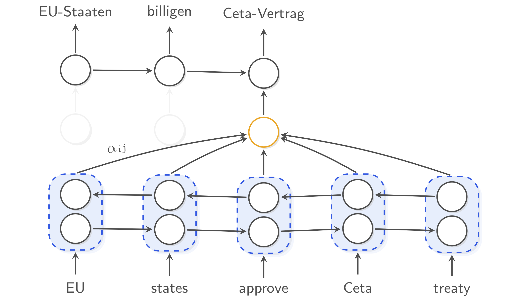
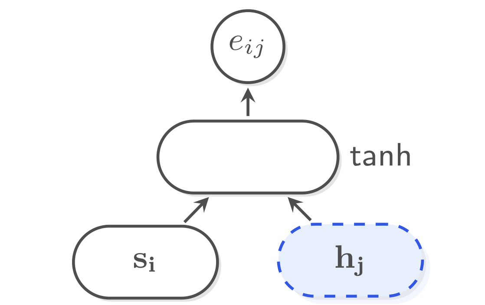
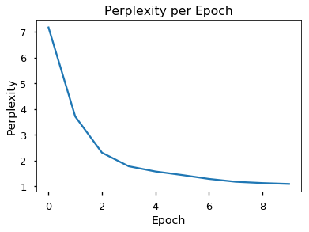
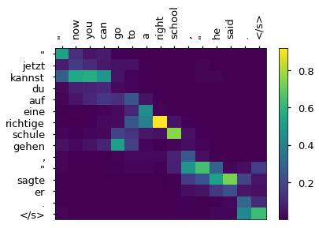

<script src="https://cdn.mathjax.org/mathjax/latest/MathJax.js?config=TeX-AMS-MML_HTMLorMML" type="text/javascript"></script>

# The Annotated Encoder-Decoder with Attention

Recently, Alexander Rush wrote a blog post called [The Annotated Transformer](http://nlp.seas.harvard.edu/2018/04/03/attention.html), describing the Transformer model from the paper [Attention is All You Need](https://arxiv.org/abs/1706.03762). This post can be seen as a **prequel** to that: *we will implement an Encoder-Decoder with Attention* using (Gated) Recurrent Neural Networks, very closely following the original attention-based neural machine translation paper ["Neural Machine Translation by Jointly Learning to Align and Translate"](https://arxiv.org/abs/1409.0473) of Bahdanau et al. (2015). 

The idea is that going through both blog posts will make you familiar with two very influential sequence-to-sequence architectures. If you have any comments or suggestions, please let me know: [@BastingsJasmijn](https://twitter.com/BastingsJasmijn).

[Click here to open this notebook in Google Colab.](https://colab.research.google.com/github/bastings/annotated_encoder_decoder/blob/master/annotated_encoder_decoder.ipynb)

# Model Architecture

We will model the probability $$p(Y\mid X)$$ of a target sequence $$Y=(y_1, \dots, y_{N})$$ given a source sequence $$X=(x_1, \dots, x_M)$$ directly with a neural network: an Encoder-Decoder.



#### Encoder 

The encoder reads in the source sentence (*at the bottom of the figure*) and produces a sequence of hidden states $$\mathbf{h}_1, \dots, \mathbf{h}_M$$, one for each source word. These states should capture the meaning of a word in its context of the given sentence.

We will use a bi-directional recurrent neural network (Bi-RNN) as the encoder; a Bi-GRU in particular.

First of all we **embed** the source words. 
We simply look up the **word embedding** for each word in a (randomly initialized) lookup table.
We will denote the word embedding for word $i$ in a given sentence with $\mathbf{x}_i$.
By embedding words, our model may exploit the fact that certain words (e.g. *cat* and *dog*) are semantically similar, and can be processed in a similar way.

Now, how do we get hidden states $$\mathbf{h}_1, \dots, \mathbf{h}_M$$? A forward GRU reads the source sentence left-to-right, while a backward GRU reads it right-to-left.
Each of them follows a simple recursive formula: 
$$\mathbf{h}_j = \text{GRU}( \mathbf{x}_j , \mathbf{h}_{j - 1} )$$
i.e. we obtain the next state from the previous state and the current input word embedding.

The hidden state of the forward GRU at time step j will know what words **precede** the word at that time step, but it doesn't know what words will follow. In contrast, the backward GRU will only know what words **follow** the word at time step j. By **concatenating** those two hidden states (*shown in blue in the figure*), we get $$\mathbf{h}_j$$, which captures word j in its full sentence context.


#### Decoder 

The decoder (*at the top of the figure*) is a GRU with hidden state $\mathbf{s_i}$. It follows a similar formula to the encoder, but takes one extra input $$\mathbf{c}_{i}$$ (*shown in yellow*).

$$\mathbf{s}_{i} = f( \mathbf{s}_{i - 1}, \mathbf{y}_{i - 1}, \mathbf{c}_i )$$

Here, $$\mathbf{y}_{i - 1}$$ is the previously generated target word (*not shown*).

At each time step, an **attention mechanism** dynamically selects that part of the source sentence that is most relevant for predicting the current target word. It does so by comparing the last decoder state with each source hidden state. The result is a context vector $\mathbf{c_i}$ (*shown in yellow*).
Later the attention mechanism is explained in more detail.

After computing the decoder state $\mathbf{s}_i$, a non-linear function $g$ (which applies a [softmax](https://en.wikipedia.org/wiki/Softmax_function)) gives us the probability of the target word $y_i$ for this time step:

$$ p(y_i \mid y_{<i}, x_1^M) = g(\mathbf{s}_i, \mathbf{c}_i, \mathbf{y}_{i - 1})$$

Because g applies a softmax, it provides a vector the size of the output vocabulary that sums to 1.0: it is a distribution over all target words. During test time, we would select the word with the highest probability for our translation.

Now, for optimization, a [cross-entropy loss](https://ml-cheatsheet.readthedocs.io/en/latest/loss_functions.html#cross-entropy) is used to maximize the probability of selecting the correct word at this time step. All parameters (including word embeddings) are then updated to maximize this probability.


# Prelims

This tutorial requires **PyTorch >= 0.4.1** and was tested with **Python 3.6**.  

Make sure you have those versions, and install the packages below if you don't have them yet.


```python
#!pip install torch numpy matplotlib sacrebleu
```


```python
%matplotlib inline
import numpy as np
import torch
import torch.nn as nn
import torch.nn.functional as F
import math, copy, time
import matplotlib.pyplot as plt
from torch.nn.utils.rnn import pack_padded_sequence, pad_packed_sequence
from IPython.core.debugger import set_trace

# we will use CUDA if it is available
USE_CUDA = torch.cuda.is_available()
DEVICE=torch.device('cuda:0') # or set to 'cpu'
print("CUDA:", USE_CUDA)
print(DEVICE)

seed = 42
np.random.seed(seed)
torch.manual_seed(seed)
torch.cuda.manual_seed(seed)
```

    CUDA: True
    cuda:0


# Let's start coding!

## Model class

Our base model class `EncoderDecoder` is very similar to the one in *The Annotated Transformer*.

One difference is that our encoder also returns its final states (`encoder_final` below), which is used to initialize the decoder RNN. We also provide the sequence lengths as the RNNs require those.


```python
class EncoderDecoder(nn.Module):
    """
    A standard Encoder-Decoder architecture. Base for this and many 
    other models.
    """
    def __init__(self, encoder, decoder, src_embed, trg_embed, generator):
        super(EncoderDecoder, self).__init__()
        self.encoder = encoder
        self.decoder = decoder
        self.src_embed = src_embed
        self.trg_embed = trg_embed
        self.generator = generator
        
    def forward(self, src, trg, src_mask, trg_mask, src_lengths, trg_lengths):
        """Take in and process masked src and target sequences."""
        encoder_hidden, encoder_final = self.encode(src, src_mask, src_lengths)
        return self.decode(encoder_hidden, encoder_final, src_mask, trg, trg_mask)
    
    def encode(self, src, src_mask, src_lengths):
        return self.encoder(self.src_embed(src), src_mask, src_lengths)
    
    def decode(self, encoder_hidden, encoder_final, src_mask, trg, trg_mask,
               decoder_hidden=None):
        return self.decoder(self.trg_embed(trg), encoder_hidden, encoder_final,
                            src_mask, trg_mask, hidden=decoder_hidden)
```

To keep things easy we also keep the `Generator` class the same. 
It simply projects the pre-output layer (x in the `forward` function below) to obtain the output layer, so that the final dimension is the target vocabulary size.


```python
class Generator(nn.Module):
    """Define standard linear + softmax generation step."""
    def __init__(self, hidden_size, vocab_size):
        super(Generator, self).__init__()
        self.proj = nn.Linear(hidden_size, vocab_size, bias=False)

    def forward(self, x):
        return F.log_softmax(self.proj(x), dim=-1)
```

## Encoder

Our encoder is a bi-directional GRU. 

Because we want to process multiple sentences at the same time for speed reasons (it is more effcient on GPU), we need to support **mini-batches**. Sentences in a mini-batch may have different lengths, which means that the RNN needs to unroll further for certain sentences while it might already have finished for others:

```
Example: mini-batch with 3 source sentences of different lengths (7, 5, and 3).
End-of-sequence is marked with a "3" here, and padding positions with "1".

+---------------+
| 4 5 9 8 7 8 3 |
+---------------+
| 5 4 8 7 3 1 1 |
+---------------+
| 5 8 3 1 1 1 1 |
+---------------+
```
You can see that, when computing hidden states for this mini-batch, for sentence #2 and #3 we will need to stop updating the hidden state after we have encountered "3". We don't want to incorporate the padding values (1s).

Luckily, PyTorch has convenient helper functions called `pack_padded_sequence` and `pad_packed_sequence`.
These functions take care of masking and padding, so that the resulting word representations are simply zeros after a sentence stops.

The code below reads in a source sentence (a sequence of word embeddings) and produces the hidden states.
It also returns a final vector, a summary of the complete sentence, by concatenating the first and the last hidden states (they have both seen the whole sentence, each in a different direction). We will use the final vector to initialize the decoder.


```python
class Encoder(nn.Module):
    """Encodes a sequence of word embeddings"""
    def __init__(self, input_size, hidden_size, num_layers=1, dropout=0.):
        super(Encoder, self).__init__()
        self.num_layers = num_layers
        self.rnn = nn.GRU(input_size, hidden_size, num_layers, 
                          batch_first=True, bidirectional=True, dropout=dropout)
        
    def forward(self, x, mask, lengths):
        """
        Applies a bidirectional GRU to sequence of embeddings x.
        The input mini-batch x needs to be sorted by length.
        x should have dimensions [batch, time, dim].
        """
        packed = pack_padded_sequence(x, lengths, batch_first=True)
        output, final = self.rnn(packed)
        output, _ = pad_packed_sequence(output, batch_first=True)

        # we need to manually concatenate the final states for both directions
        fwd_final = final[0:final.size(0):2]
        bwd_final = final[1:final.size(0):2]
        final = torch.cat([fwd_final, bwd_final], dim=2)  # [num_layers, batch, 2*dim]

        return output, final
```

### Decoder

The decoder is a conditional GRU. Rather than starting with an empty state like the encoder, its initial hidden state results from a projection of the encoder final vector. 

#### Training
In `forward` you can find a for-loop that computes the decoder hidden states one time step at a time. 
Note that, during training, we know exactly what the target words should be! (They are in `trg_embed`.) This means that we are not even checking here what the prediction is! We simply feed the correct previous target word embedding to the GRU at each time step. This is called teacher forcing.

The `forward` function returns all decoder hidden states and pre-output vectors. Elsewhere these are used to compute the loss, after which the parameters are updated.

#### Prediction
For prediction time, for forward function is only used for a single time step. After predicting a word from the returned pre-output vector, we can call it again, supplying it the word embedding of the previously predicted word and the last state.


```python
class Decoder(nn.Module):
    """A conditional RNN decoder with attention."""
    
    def __init__(self, emb_size, hidden_size, attention, num_layers=1, dropout=0.5,
                 bridge=True):
        super(Decoder, self).__init__()
        
        self.hidden_size = hidden_size
        self.num_layers = num_layers
        self.attention = attention
        self.dropout = dropout
                 
        self.rnn = nn.GRU(emb_size + 2*hidden_size, hidden_size, num_layers,
                          batch_first=True, dropout=dropout)
                 
        # to initialize from the final encoder state
        self.bridge = nn.Linear(2*hidden_size, hidden_size, bias=True) if bridge else None

        self.dropout_layer = nn.Dropout(p=dropout)
        self.pre_output_layer = nn.Linear(hidden_size + 2*hidden_size + emb_size,
                                          hidden_size, bias=False)
        
    def forward_step(self, prev_embed, encoder_hidden, src_mask, proj_key, hidden):
        """Perform a single decoder step (1 word)"""

        # compute context vector using attention mechanism
        query = hidden[-1].unsqueeze(1)  # [#layers, B, D] -> [B, 1, D]
        context, attn_probs = self.attention(
            query=query, proj_key=proj_key,
            value=encoder_hidden, mask=src_mask)

        # update rnn hidden state
        rnn_input = torch.cat([prev_embed, context], dim=2)
        output, hidden = self.rnn(rnn_input, hidden)
        
        pre_output = torch.cat([prev_embed, output, context], dim=2)
        pre_output = self.dropout_layer(pre_output)
        pre_output = self.pre_output_layer(pre_output)

        return output, hidden, pre_output
    
    def forward(self, trg_embed, encoder_hidden, encoder_final, 
                src_mask, trg_mask, hidden=None, max_len=None):
        """Unroll the decoder one step at a time."""
                                         
        # the maximum number of steps to unroll the RNN
        if max_len is None:
            max_len = trg_mask.size(-1)

        # initialize decoder hidden state
        if hidden is None:
            hidden = self.init_hidden(encoder_final)
        
        # pre-compute projected encoder hidden states
        # (the "keys" for the attention mechanism)
        # this is only done for efficiency
        proj_key = self.attention.key_layer(encoder_hidden)
        
        # here we store all intermediate hidden states and pre-output vectors
        decoder_states = []
        pre_output_vectors = []
        
        # unroll the decoder RNN for max_len steps
        for i in range(max_len):
            prev_embed = trg_embed[:, i].unsqueeze(1)
            output, hidden, pre_output = self.forward_step(
              prev_embed, encoder_hidden, src_mask, proj_key, hidden)
            decoder_states.append(output)
            pre_output_vectors.append(pre_output)

        decoder_states = torch.cat(decoder_states, dim=1)
        pre_output_vectors = torch.cat(pre_output_vectors, dim=1)
        return decoder_states, hidden, pre_output_vectors  # [B, N, D]

    def init_hidden(self, encoder_final):
        """Returns the initial decoder state,
        conditioned on the final encoder state."""

        if encoder_final is None:
            return None  # start with zeros

        return torch.tanh(self.bridge(encoder_final))            

```

### Attention                                                                                                                                                                               

At every time step, the decoder has access to *all* source word representations $$\mathbf{h}_1, \dots, \mathbf{h}_M$$. 
An attention mechanism allows the model to focus on the currently most relevant part of the source sentence.
The state of the decoder is represented by GRU hidden state $$\mathbf{s}_i$$.
So if we want to know which source word representation(s) $$\mathbf{h}_j$$ are most relevant, we will need to define a function that takes those two things as input.

Here we use the MLP-based, additive attention that was used in Bahdanau et al.:




We apply an MLP with tanh-activation to both the current decoder state $$\bf s_i$$ (the *query*) and each encoder state $$\bf h_j$$ (the *key*), and then project this to a single value (i.e. a scalar) to get the *attention energy* $$e_{ij}$$. 

Once all energies are computed, they are normalized by a softmax so that they sum to one: 

$$ \alpha_{ij} = \text{softmax}(\mathbf{e}_i)[j] $$

$$\sum_j \alpha_{ij} = 1.0$$ 

The context vector for time step $i$ is then a weighted sum of the encoder hidden states (the *values*):
$$\mathbf{c}_i = \sum_j \alpha_{ij} \mathbf{h}_j$$


```python
class BahdanauAttention(nn.Module):
    """Implements Bahdanau (MLP) attention"""
    
    def __init__(self, hidden_size, key_size=None, query_size=None):
        super(BahdanauAttention, self).__init__()
        
        # We assume a bi-directional encoder so key_size is 2*hidden_size
        key_size = 2 * hidden_size if key_size is None else key_size
        query_size = hidden_size if query_size is None else query_size

        self.key_layer = nn.Linear(key_size, hidden_size, bias=False)
        self.query_layer = nn.Linear(query_size, hidden_size, bias=False)
        self.energy_layer = nn.Linear(hidden_size, 1, bias=False)
        
        # to store attention scores
        self.alphas = None
        
    def forward(self, query=None, proj_key=None, value=None, mask=None):
        assert mask is not None, "mask is required"

        # We first project the query (the decoder state).
        # The projected keys (the encoder states) were already pre-computated.
        query = self.query_layer(query)
        
        # Calculate scores.
        scores = self.energy_layer(torch.tanh(query + proj_key))
        scores = scores.squeeze(2).unsqueeze(1)
        
        # Mask out invalid positions.
        # The mask marks valid positions so we invert it using `mask & 0`.
        scores.data.masked_fill_(mask == 0, -float('inf'))
        
        # Turn scores to probabilities.
        alphas = F.softmax(scores, dim=-1)
        self.alphas = alphas        
        
        # The context vector is the weighted sum of the values.
        context = torch.bmm(alphas, value)
        
        # context shape: [B, 1, 2D], alphas shape: [B, 1, M]
        return context, alphas
```

## Embeddings and Softmax                                                                                                                                                                                                                                                                                           
We use learned embeddings to convert the input tokens and output tokens to vectors of dimension `emb_size`.

We will simply use PyTorch's [nn.Embedding](https://pytorch.org/docs/stable/nn.html?highlight=embedding#torch.nn.Embedding) class.

## Full Model

Here we define a function from hyperparameters to a full model. 


```python
def make_model(src_vocab, tgt_vocab, emb_size=256, hidden_size=512, num_layers=1, dropout=0.1):
    "Helper: Construct a model from hyperparameters."

    attention = BahdanauAttention(hidden_size)

    model = EncoderDecoder(
        Encoder(emb_size, hidden_size, num_layers=num_layers, dropout=dropout),
        Decoder(emb_size, hidden_size, attention, num_layers=num_layers, dropout=dropout),
        nn.Embedding(src_vocab, emb_size),
        nn.Embedding(tgt_vocab, emb_size),
        Generator(hidden_size, tgt_vocab))

    return model.cuda() if USE_CUDA else model
```

# Training

This section describes the training regime for our models.

We stop for a quick interlude to introduce some of the tools 
needed to train a standard encoder decoder model. First we define a batch object that holds the src and target sentences for training, as well as their lengths and masks. 

## Batches and Masking


```python
class Batch:
    """Object for holding a batch of data with mask during training.
    Input is a batch from a torch text iterator.
    """
    def __init__(self, src, trg, pad_index=0):
        
        src, src_lengths = src
        
        self.src = src
        self.src_lengths = src_lengths
        self.src_mask = (src != pad_index).unsqueeze(-2)
        self.nseqs = src.size(0)
        
        self.trg = None
        self.trg_y = None
        self.trg_mask = None
        self.trg_lengths = None
        self.ntokens = None

        if trg is not None:
            trg, trg_lengths = trg
            self.trg = trg[:, :-1]
            self.trg_lengths = trg_lengths
            self.trg_y = trg[:, 1:]
            self.trg_mask = (self.trg_y != pad_index)
            self.ntokens = (self.trg_y != pad_index).data.sum().item()
        
        if USE_CUDA:
            self.src = self.src.cuda()
            self.src_mask = self.src_mask.cuda()

            if trg is not None:
                self.trg = self.trg.cuda()
                self.trg_y = self.trg_y.cuda()
                self.trg_mask = self.trg_mask.cuda()
                
```

## Training Loop
The code below trains the model for 1 epoch (=1 pass through the training data).


```python
def run_epoch(data_iter, model, loss_compute, print_every=50):
    """Standard Training and Logging Function"""

    start = time.time()
    total_tokens = 0
    total_loss = 0
    print_tokens = 0

    for i, batch in enumerate(data_iter, 1):
        
        out, _, pre_output = model.forward(batch.src, batch.trg,
                                           batch.src_mask, batch.trg_mask,
                                           batch.src_lengths, batch.trg_lengths)
        loss = loss_compute(pre_output, batch.trg_y, batch.nseqs)
        total_loss += loss
        total_tokens += batch.ntokens
        print_tokens += batch.ntokens
        
        if model.training and i % print_every == 0:
            elapsed = time.time() - start
            print("Epoch Step: %d Loss: %f Tokens per Sec: %f" %
                    (i, loss / batch.nseqs, print_tokens / elapsed))
            start = time.time()
            print_tokens = 0

    return math.exp(total_loss / float(total_tokens))
```

## Training Data and Batching

We will use torch text for batching. This is discussed in more detail below. 

## Optimizer

We will use the [Adam optimizer](https://arxiv.org/abs/1412.6980) with default settings ($$\beta_1=0.9$$, $$\beta_2=0.999$$ and $$\epsilon=10^{-8}$$).

We will use 0.0003 as the learning rate here, but for different problems another learning rate may be more appropriate. You will have to tune that.

# A First  Example

We can begin by trying out a simple copy-task. Given a random set of input symbols from a small vocabulary, the goal is to generate back those same symbols. 

## Synthetic Data


```python
def data_gen(num_words=11, batch_size=16, num_batches=100, length=10, pad_index=0, sos_index=1):
    """Generate random data for a src-tgt copy task."""
    for i in range(num_batches):
        data = torch.from_numpy(
          np.random.randint(1, num_words, size=(batch_size, length)))
        data[:, 0] = sos_index
        data = data.cuda() if USE_CUDA else data
        src = data[:, 1:]
        trg = data
        src_lengths = [length-1] * batch_size
        trg_lengths = [length] * batch_size
        yield Batch((src, src_lengths), (trg, trg_lengths), pad_index=pad_index)
```

## Loss Computation


```python
class SimpleLossCompute:
    """A simple loss compute and train function."""

    def __init__(self, generator, criterion, opt=None):
        self.generator = generator
        self.criterion = criterion
        self.opt = opt

    def __call__(self, x, y, norm):
        x = self.generator(x)
        loss = self.criterion(x.contiguous().view(-1, x.size(-1)),
                              y.contiguous().view(-1))
        loss = loss / norm

        if self.opt is not None:
            loss.backward()          
            self.opt.step()
            self.opt.zero_grad()

        return loss.data.item() * norm
```

### Printing examples

To monitor progress during training, we will translate a few examples.

We use greedy decoding for simplicity; that is, at each time step, starting at the first token, we choose the one with that maximum probability, and we never revisit that choice. 


```python
def greedy_decode(model, src, src_mask, src_lengths, max_len=100, sos_index=1, eos_index=None):
    """Greedily decode a sentence."""

    with torch.no_grad():
        encoder_hidden, encoder_final = model.encode(src, src_mask, src_lengths)
        prev_y = torch.ones(1, 1).fill_(sos_index).type_as(src)
        trg_mask = torch.ones_like(prev_y)

    output = []
    attention_scores = []
    hidden = None

    for i in range(max_len):
        with torch.no_grad():
            out, hidden, pre_output = model.decode(
              encoder_hidden, encoder_final, src_mask,
              prev_y, trg_mask, hidden)

            # we predict from the pre-output layer, which is
            # a combination of Decoder state, prev emb, and context
            prob = model.generator(pre_output[:, -1])

        _, next_word = torch.max(prob, dim=1)
        next_word = next_word.data.item()
        output.append(next_word)
        prev_y = torch.ones(1, 1).type_as(src).fill_(next_word)
        attention_scores.append(model.decoder.attention.alphas.cpu().numpy())
    
    output = np.array(output)
        
    # cut off everything starting from </s> 
    # (only when eos_index provided)
    if eos_index is not None:
        first_eos = np.where(output==eos_index)[0]
        if len(first_eos) > 0:
            output = output[:first_eos[0]]      
    
    return output, np.concatenate(attention_scores, axis=1)
  

def lookup_words(x, vocab=None):
    if vocab is not None:
        x = [vocab.itos[i] for i in x]

    return [str(t) for t in x]
```


```python
def print_examples(example_iter, model, n=2, max_len=100, 
                   sos_index=1, 
                   src_eos_index=None, 
                   trg_eos_index=None, 
                   src_vocab=None, trg_vocab=None):
    """Prints N examples. Assumes batch size of 1."""

    model.eval()
    count = 0
    print()
    
    if src_vocab is not None and trg_vocab is not None:
        src_eos_index = src_vocab.stoi[EOS_TOKEN]
        trg_sos_index = trg_vocab.stoi[SOS_TOKEN]
        trg_eos_index = trg_vocab.stoi[EOS_TOKEN]
    else:
        src_eos_index = None
        trg_sos_index = 1
        trg_eos_index = None
        
    for i, batch in enumerate(example_iter):
      
        src = batch.src.cpu().numpy()[0, :]
        trg = batch.trg_y.cpu().numpy()[0, :]

        # remove </s> (if it is there)
        src = src[:-1] if src[-1] == src_eos_index else src
        trg = trg[:-1] if trg[-1] == trg_eos_index else trg      
      
        result, _ = greedy_decode(
          model, batch.src, batch.src_mask, batch.src_lengths,
          max_len=max_len, sos_index=trg_sos_index, eos_index=trg_eos_index)
        print("Example #%d" % (i+1))
        print("Src : ", " ".join(lookup_words(src, vocab=src_vocab)))
        print("Trg : ", " ".join(lookup_words(trg, vocab=trg_vocab)))
        print("Pred: ", " ".join(lookup_words(result, vocab=trg_vocab)))
        print()
        
        count += 1
        if count == n:
            break
```

## Training the copy task


```python
def train_copy_task():
    """Train the simple copy task."""
    num_words = 11
    criterion = nn.NLLLoss(reduction="sum", ignore_index=0)
    model = make_model(num_words, num_words, emb_size=32, hidden_size=64)
    optim = torch.optim.Adam(model.parameters(), lr=0.0003)
    eval_data = list(data_gen(num_words=num_words, batch_size=1, num_batches=100))
 
    dev_perplexities = []
    
    if USE_CUDA:
        model.cuda()

    for epoch in range(10):
        
        print("Epoch %d" % epoch)

        # train
        model.train()
        data = data_gen(num_words=num_words, batch_size=32, num_batches=100)
        run_epoch(data, model,
                  SimpleLossCompute(model.generator, criterion, optim))

        # evaluate
        model.eval()
        with torch.no_grad(): 
            perplexity = run_epoch(eval_data, model,
                                   SimpleLossCompute(model.generator, criterion, None))
            print("Evaluation perplexity: %f" % perplexity)
            dev_perplexities.append(perplexity)
            print_examples(eval_data, model, n=2, max_len=9)
        
    return dev_perplexities
```


```python
# train the copy task
dev_perplexities = train_copy_task()

def plot_perplexity(perplexities):
    """plot perplexities"""
    plt.title("Perplexity per Epoch")
    plt.xlabel("Epoch")
    plt.ylabel("Perplexity")
    plt.plot(perplexities)
    
plot_perplexity(dev_perplexities)
```

    /home/jb/envs/pytorch/lib/python3.6/site-packages/torch/nn/modules/rnn.py:38: UserWarning: dropout option adds dropout after all but last recurrent layer, so non-zero dropout expects num_layers greater than 1, but got dropout=0.1 and num_layers=1
      "num_layers={}".format(dropout, num_layers))


    Epoch 0
    Epoch Step: 50 Loss: 19.887581 Tokens per Sec: 7748.957397
    Epoch Step: 100 Loss: 17.856726 Tokens per Sec: 7925.338918
    Evaluation perplexity: 7.172198
    
    Example #1
    Src :  4 8 5 7 10 3 7 8 5
    Trg :  4 8 5 7 10 3 7 8 5
    Pred:  8 3 7 5 8 3 7 5 8
    
    Example #2
    Src :  8 8 3 6 5 2 8 6 2
    Trg :  8 8 3 6 5 2 8 6 2
    Pred:  8 8 8 8 8 8 8 8 8
    
    Epoch 1
    Epoch Step: 50 Loss: 15.715487 Tokens per Sec: 8662.903188
    Epoch Step: 100 Loss: 12.368280 Tokens per Sec: 7860.172940
    Evaluation perplexity: 3.709498
    
    Example #1
    Src :  4 8 5 7 10 3 7 8 5
    Trg :  4 8 5 7 10 3 7 8 5
    Pred:  4 8 7 5 10 8 7 5 7
    
    Example #2
    Src :  8 8 3 6 5 2 8 6 2
    Trg :  8 8 3 6 5 2 8 6 2
    Pred:  8 8 5 6 2 6 8 2 5
    
    Epoch 2
    Epoch Step: 50 Loss: 9.246480 Tokens per Sec: 7971.095313
    Epoch Step: 100 Loss: 7.701921 Tokens per Sec: 7876.198908
    Evaluation perplexity: 2.303158
    
    Example #1
    Src :  4 8 5 7 10 3 7 8 5
    Trg :  4 8 5 7 10 3 7 8 5
    Pred:  4 8 7 3 10 5 8 7 5
    
    Example #2
    Src :  8 8 3 6 5 2 8 6 2
    Trg :  8 8 3 6 5 2 8 6 2
    Pred:  8 8 5 6 2 6 8 5 2
    
    Epoch 3
    Epoch Step: 50 Loss: 6.166847 Tokens per Sec: 8069.631171
    Epoch Step: 100 Loss: 5.673258 Tokens per Sec: 7855.858586
    Evaluation perplexity: 1.775795
    
    Example #1
    Src :  4 8 5 7 10 3 7 8 5
    Trg :  4 8 5 7 10 3 7 8 5
    Pred:  4 8 7 5 10 3 7 8 5
    
    Example #2
    Src :  8 8 3 6 5 2 8 6 2
    Trg :  8 8 3 6 5 2 8 6 2
    Pred:  8 8 3 6 5 2 8 6 8
    
    Epoch 4
    Epoch Step: 50 Loss: 4.830031 Tokens per Sec: 8094.515152
    Epoch Step: 100 Loss: 4.152125 Tokens per Sec: 7999.315744
    Evaluation perplexity: 1.572305
    
    Example #1
    Src :  4 8 5 7 10 3 7 8 5
    Trg :  4 8 5 7 10 3 7 8 5
    Pred:  4 8 5 7 10 3 7 8 5
    
    Example #2
    Src :  8 8 3 6 5 2 8 6 2
    Trg :  8 8 3 6 5 2 8 6 2
    Pred:  8 8 3 6 5 2 8 6 2
    
    Epoch 5
    Epoch Step: 50 Loss: 3.638369 Tokens per Sec: 8112.868501
    Epoch Step: 100 Loss: 3.784709 Tokens per Sec: 7843.288141
    Evaluation perplexity: 1.433951
    
    Example #1
    Src :  4 8 5 7 10 3 7 8 5
    Trg :  4 8 5 7 10 3 7 8 5
    Pred:  4 8 7 5 3 10 7 8 7
    
    Example #2
    Src :  8 8 3 6 5 2 8 6 2
    Trg :  8 8 3 6 5 2 8 6 2
    Pred:  8 8 3 6 5 2 8 6 2
    
    Epoch 6
    Epoch Step: 50 Loss: 2.802792 Tokens per Sec: 8128.952327
    Epoch Step: 100 Loss: 2.403310 Tokens per Sec: 7893.746819
    Evaluation perplexity: 1.284198
    
    Example #1
    Src :  4 8 5 7 10 3 7 8 5
    Trg :  4 8 5 7 10 3 7 8 5
    Pred:  4 8 5 7 10 3 7 8 5
    
    Example #2
    Src :  8 8 3 6 5 2 8 6 2
    Trg :  8 8 3 6 5 2 8 6 2
    Pred:  8 8 3 6 5 2 8 6 2
    
    Epoch 7
    Epoch Step: 50 Loss: 2.174423 Tokens per Sec: 8181.341663
    Epoch Step: 100 Loss: 1.838792 Tokens per Sec: 7833.160747
    Evaluation perplexity: 1.173110
    
    Example #1
    Src :  4 8 5 7 10 3 7 8 5
    Trg :  4 8 5 7 10 3 7 8 5
    Pred:  4 8 5 7 10 3 7 8 5
    
    Example #2
    Src :  8 8 3 6 5 2 8 6 2
    Trg :  8 8 3 6 5 2 8 6 2
    Pred:  8 8 3 6 5 2 8 6 2
    
    Epoch 8
    Epoch Step: 50 Loss: 1.226522 Tokens per Sec: 8267.548130
    Epoch Step: 100 Loss: 1.090876 Tokens per Sec: 7842.856308
    Evaluation perplexity: 1.123090
    
    Example #1
    Src :  4 8 5 7 10 3 7 8 5
    Trg :  4 8 5 7 10 3 7 8 5
    Pred:  4 8 5 7 10 3 7 8 5
    
    Example #2
    Src :  8 8 3 6 5 2 8 6 2
    Trg :  8 8 3 6 5 2 8 6 2
    Pred:  8 8 3 6 5 2 8 6 2
    
    Epoch 9
    Epoch Step: 50 Loss: 1.216270 Tokens per Sec: 8181.132215
    Epoch Step: 100 Loss: 0.636999 Tokens per Sec: 7866.309111
    Evaluation perplexity: 1.088564
    
    Example #1
    Src :  4 8 5 7 10 3 7 8 5
    Trg :  4 8 5 7 10 3 7 8 5
    Pred:  4 8 5 7 10 3 7 8 5
    
    Example #2
    Src :  8 8 3 6 5 2 8 6 2
    Trg :  8 8 3 6 5 2 8 6 2
    Pred:  8 8 3 6 5 2 8 6 2
    





You can see that the model managed to correctly 'translate' the two examples in the end.

Moreover, the perplexity of the development data nicely went down towards 1.

# A Real World Example

Now we consider a real-world example using the IWSLT German-English Translation task. 
This task is much smaller than usual, but it illustrates the whole system. 

The cell below installs torch text and spacy. This might take a while.


```python
#!pip install git+git://github.com/pytorch/text spacy 
#!python -m spacy download en
#!python -m spacy download de
```

## Data Loading

We will load the dataset using torchtext and spacy for tokenization.

This cell might take a while to run the first time, as it will download and tokenize the IWSLT data.

For speed we only include short sentences, and we include a word in the vocabulary only if it occurs at least 5 times. In this case we also lowercase the data.

If you have **issues** with torch text in the cell below (e.g. an `ascii` error), try running `export LC_ALL="en_US.UTF-8"` before you start `jupyter notebook`.


```python
# For data loading.
from torchtext import data, datasets

if True:
    import spacy
    spacy_de = spacy.load('de')
    spacy_en = spacy.load('en')

    def tokenize_de(text):
        return [tok.text for tok in spacy_de.tokenizer(text)]

    def tokenize_en(text):
        return [tok.text for tok in spacy_en.tokenizer(text)]

    UNK_TOKEN = "<unk>"
    PAD_TOKEN = "<pad>"    
    SOS_TOKEN = "<s>"
    EOS_TOKEN = "</s>"
    LOWER = True
    
    # we include lengths to provide to the RNNs
    SRC = data.Field(tokenize=tokenize_de, 
                     batch_first=True, lower=LOWER, include_lengths=True,
                     unk_token=UNK_TOKEN, pad_token=PAD_TOKEN, init_token=None, eos_token=EOS_TOKEN)
    TRG = data.Field(tokenize=tokenize_en, 
                     batch_first=True, lower=LOWER, include_lengths=True,
                     unk_token=UNK_TOKEN, pad_token=PAD_TOKEN, init_token=SOS_TOKEN, eos_token=EOS_TOKEN)

    MAX_LEN = 25  # NOTE: we filter out a lot of sentences for speed
    train_data, valid_data, test_data = datasets.IWSLT.splits(
        exts=('.de', '.en'), fields=(SRC, TRG), 
        filter_pred=lambda x: len(vars(x)['src']) <= MAX_LEN and 
            len(vars(x)['trg']) <= MAX_LEN)
    MIN_FREQ = 5  # NOTE: we limit the vocabulary to frequent words for speed
    SRC.build_vocab(train_data.src, min_freq=MIN_FREQ)
    TRG.build_vocab(train_data.trg, min_freq=MIN_FREQ)
    
    PAD_INDEX = TRG.vocab.stoi[PAD_TOKEN]

```

### Let's look at the data

It never hurts to look at your data and some statistics.


```python
def print_data_info(train_data, valid_data, test_data, src_field, trg_field):
    """ This prints some useful stuff about our data sets. """

    print("Data set sizes (number of sentence pairs):")
    print('train', len(train_data))
    print('valid', len(valid_data))
    print('test', len(test_data), "\n")

    print("First training example:")
    print("src:", " ".join(vars(train_data[0])['src']))
    print("trg:", " ".join(vars(train_data[0])['trg']), "\n")

    print("Most common words (src):")
    print("\n".join(["%10s %10d" % x for x in src_field.vocab.freqs.most_common(10)]), "\n")
    print("Most common words (trg):")
    print("\n".join(["%10s %10d" % x for x in trg_field.vocab.freqs.most_common(10)]), "\n")

    print("First 10 words (src):")
    print("\n".join(
        '%02d %s' % (i, t) for i, t in enumerate(src_field.vocab.itos[:10])), "\n")
    print("First 10 words (trg):")
    print("\n".join(
        '%02d %s' % (i, t) for i, t in enumerate(trg_field.vocab.itos[:10])), "\n")

    print("Number of German words (types):", len(src_field.vocab))
    print("Number of English words (types):", len(trg_field.vocab), "\n")
    
    
print_data_info(train_data, valid_data, test_data, SRC, TRG)
```

    Data set sizes (number of sentence pairs):
    train 143116
    valid 690
    test 963 
    
    First training example:
    src: david gallo : das ist bill lange . ich bin dave gallo .
    trg: david gallo : this is bill lange . i 'm dave gallo . 
    
    Most common words (src):
             .     138325
             ,     105944
           und      41839
           die      40809
           das      33324
           sie      33035
           ich      31153
           ist      31035
            es      27449
           wir      25817 
    
    Most common words (trg):
             .     137259
             ,      91619
           the      73344
           and      50273
            to      42798
             a      39573
            of      39496
             i      33524
            it      32921
          that      32643 
    
    First 10 words (src):
    00 <unk>
    01 <pad>
    02 </s>
    03 .
    04 ,
    05 und
    06 die
    07 das
    08 sie
    09 ich 
    
    First 10 words (trg):
    00 <unk>
    01 <pad>
    02 <s>
    03 </s>
    04 .
    05 ,
    06 the
    07 and
    08 to
    09 a 
    
    Number of German words (types): 15761
    Number of English words (types): 13003 
    


## Iterators
Batching matters a ton for speed. We will use torch text's BucketIterator here to get batches containing sentences of (almost) the same length.

#### Note on sorting batches for RNNs in PyTorch

For effiency reasons, PyTorch RNNs require that batches have been sorted by length, with the longest sentence in the batch first. For training, we simply sort each batch. 
For validation, we would run into trouble if we want to compare our translations with some external file that was not sorted. Therefore we simply set the validation batch size to 1, so that we can keep it in the original order.


```python
train_iter = data.BucketIterator(train_data, batch_size=64, train=True, 
                                 sort_within_batch=True, 
                                 sort_key=lambda x: (len(x.src), len(x.trg)), repeat=False,
                                 device=DEVICE)
valid_iter = data.Iterator(valid_data, batch_size=1, train=False, sort=False, repeat=False, 
                           device=DEVICE)


def rebatch(pad_idx, batch):
    """Wrap torchtext batch into our own Batch class for pre-processing"""
    return Batch(batch.src, batch.trg, pad_idx)
```

## Training the System

Now we train the model. 

On a Titan X GPU, this runs at ~18,000 tokens per second with a batch size of 64.


```python
def train(model, num_epochs=10, lr=0.0003, print_every=100):
    """Train a model on IWSLT"""
    
    if USE_CUDA:
        model.cuda()

    # optionally add label smoothing; see the Annotated Transformer
    criterion = nn.NLLLoss(reduction="sum", ignore_index=PAD_INDEX)
    optim = torch.optim.Adam(model.parameters(), lr=lr)
    
    dev_perplexities = []

    for epoch in range(num_epochs):
      
        print("Epoch", epoch)
        model.train()
        train_perplexity = run_epoch((rebatch(PAD_INDEX, b) for b in train_iter), 
                                     model,
                                     SimpleLossCompute(model.generator, criterion, optim),
                                     print_every=print_every)
        
        model.eval()
        with torch.no_grad():
            print_examples((rebatch(PAD_INDEX, x) for x in valid_iter), 
                           model, n=3, src_vocab=SRC.vocab, trg_vocab=TRG.vocab)        

            dev_perplexity = run_epoch((rebatch(PAD_INDEX, b) for b in valid_iter), 
                                       model, 
                                       SimpleLossCompute(model.generator, criterion, None))
            print("Validation perplexity: %f" % dev_perplexity)
            dev_perplexities.append(dev_perplexity)
        
    return dev_perplexities
        
```


```python
model = make_model(len(SRC.vocab), len(TRG.vocab),
                   emb_size=256, hidden_size=256,
                   num_layers=1, dropout=0.2)
dev_perplexities = train(model, print_every=100)
```

    Epoch 0


    /home/jb/envs/pytorch/lib/python3.6/site-packages/torch/nn/modules/rnn.py:38: UserWarning: dropout option adds dropout after all but last recurrent layer, so non-zero dropout expects num_layers greater than 1, but got dropout=0.2 and num_layers=1
      "num_layers={}".format(dropout, num_layers))


    Epoch Step: 100 Loss: 22.353386 Tokens per Sec: 16007.731248
    Epoch Step: 200 Loss: 34.410126 Tokens per Sec: 16368.906298
    Epoch Step: 300 Loss: 44.763870 Tokens per Sec: 16586.324787
    Epoch Step: 400 Loss: 57.584606 Tokens per Sec: 16717.486756
    Epoch Step: 500 Loss: 40.508701 Tokens per Sec: 16486.886104
    Epoch Step: 600 Loss: 51.919121 Tokens per Sec: 16529.862635
    Epoch Step: 700 Loss: 82.279633 Tokens per Sec: 16973.462052
    Epoch Step: 800 Loss: 35.026432 Tokens per Sec: 16724.939524
    Epoch Step: 900 Loss: 63.407204 Tokens per Sec: 16606.524355
    Epoch Step: 1000 Loss: 37.909828 Tokens per Sec: 19105.497130
    Epoch Step: 1100 Loss: 90.584244 Tokens per Sec: 19643.264684
    Epoch Step: 1200 Loss: 84.000832 Tokens per Sec: 19468.084935
    Epoch Step: 1300 Loss: 54.331242 Tokens per Sec: 19679.282614
    Epoch Step: 1400 Loss: 49.921040 Tokens per Sec: 19629.820942
    Epoch Step: 1500 Loss: 21.851797 Tokens per Sec: 19565.639729
    Epoch Step: 1600 Loss: 55.154270 Tokens per Sec: 19515.738007
    Epoch Step: 1700 Loss: 40.758137 Tokens per Sec: 19486.791554
    Epoch Step: 1800 Loss: 50.094219 Tokens per Sec: 19761.236905
    Epoch Step: 1900 Loss: 90.545143 Tokens per Sec: 19447.650965
    Epoch Step: 2000 Loss: 22.882494 Tokens per Sec: 19539.331538
    Epoch Step: 2100 Loss: 99.448174 Tokens per Sec: 19278.704892
    Epoch Step: 2200 Loss: 16.793839 Tokens per Sec: 19183.702688
    
    Example #1
    Src :  als ich 11 jahre alt war , wurde ich eines morgens von den <unk> heller freude geweckt .
    Trg :  when i was 11 , i remember waking up one morning to the sound of joy in my house .
    Pred:  when i was born years old , i was a <unk> of the <unk> of the <unk> .
    
    Example #2
    Src :  mein vater hörte sich auf seinem kleinen , grauen radio die <unk> der bbc an .
    Trg :  my father was listening to bbc news on his small , gray radio .
    Pred:  my father was on his <unk> , the <unk> of the <unk> .
    
    Example #3
    Src :  er sah sehr glücklich aus , was damals ziemlich ungewöhnlich war , da ihn die nachrichten meistens <unk> .
    Trg :  there was a big smile on his face which was unusual then , because the news mostly depressed him .
    Pred:  he was very interested in the way , what was pretty much more , and then it was the <unk> .
    
    Validation perplexity: 31.839708
    Epoch 1
    Epoch Step: 100 Loss: 4.451122 Tokens per Sec: 19110.156367
    Epoch Step: 200 Loss: 11.262838 Tokens per Sec: 19538.253630
    Epoch Step: 300 Loss: 55.240711 Tokens per Sec: 19584.509548
    Epoch Step: 400 Loss: 54.733456 Tokens per Sec: 19787.183104
    Epoch Step: 500 Loss: 38.923244 Tokens per Sec: 19385.772613
    Epoch Step: 600 Loss: 63.162933 Tokens per Sec: 19013.165752
    Epoch Step: 700 Loss: 47.323864 Tokens per Sec: 18863.104141
    Epoch Step: 800 Loss: 43.414978 Tokens per Sec: 19258.337491
    Epoch Step: 900 Loss: 87.750214 Tokens per Sec: 19179.949782
    Epoch Step: 1000 Loss: 39.787056 Tokens per Sec: 19110.748464
    Epoch Step: 1100 Loss: 78.177170 Tokens per Sec: 19272.044197
    Epoch Step: 1200 Loss: 37.122997 Tokens per Sec: 19194.535740
    Epoch Step: 1300 Loss: 26.103378 Tokens per Sec: 19337.967366
    Epoch Step: 1400 Loss: 78.804855 Tokens per Sec: 19018.413406
    Epoch Step: 1500 Loss: 61.593956 Tokens per Sec: 19259.272095
    Epoch Step: 1600 Loss: 81.611786 Tokens per Sec: 19259.527179
    Epoch Step: 1700 Loss: 28.692696 Tokens per Sec: 19230.891840
    Epoch Step: 1800 Loss: 84.163223 Tokens per Sec: 19071.272023
    Epoch Step: 1900 Loss: 36.782116 Tokens per Sec: 19209.383788
    Epoch Step: 2000 Loss: 56.666332 Tokens per Sec: 19127.522297
    Epoch Step: 2100 Loss: 5.576357 Tokens per Sec: 18957.458966
    Epoch Step: 2200 Loss: 38.791512 Tokens per Sec: 19166.811446
    
    Example #1
    Src :  als ich 11 jahre alt war , wurde ich eines morgens von den <unk> heller freude geweckt .
    Trg :  when i was 11 , i remember waking up one morning to the sound of joy in my house .
    Pred:  when i was 11 years old , i was a <unk> of the <unk> <unk> .
    
    Example #2
    Src :  mein vater hörte sich auf seinem kleinen , grauen radio die <unk> der bbc an .
    Trg :  my father was listening to bbc news on his small , gray radio .
    Pred:  my father was on his <unk> , in the little <unk> , the <unk> of the <unk> .
    
    Example #3
    Src :  er sah sehr glücklich aus , was damals ziemlich ungewöhnlich war , da ihn die nachrichten meistens <unk> .
    Trg :  there was a big smile on his face which was unusual then , because the news mostly depressed him .
    Pred:  he saw very happy , what was pretty much , and it was the <unk> of the <unk> .
    
    Validation perplexity: 19.906190
    Epoch 2
    Epoch Step: 100 Loss: 58.981544 Tokens per Sec: 19121.747106
    Epoch Step: 200 Loss: 34.874680 Tokens per Sec: 19689.768904
    Epoch Step: 300 Loss: 27.895102 Tokens per Sec: 19751.401628
    Epoch Step: 400 Loss: 52.931011 Tokens per Sec: 16369.447354
    Epoch Step: 500 Loss: 77.191933 Tokens per Sec: 16337.808093
    Epoch Step: 600 Loss: 65.645668 Tokens per Sec: 16307.871308
    Epoch Step: 700 Loss: 7.141161 Tokens per Sec: 16420.432824
    Epoch Step: 800 Loss: 76.990250 Tokens per Sec: 17512.558218
    Epoch Step: 900 Loss: 43.835995 Tokens per Sec: 16399.672659
    Epoch Step: 1000 Loss: 68.026192 Tokens per Sec: 16598.504664
    Epoch Step: 1100 Loss: 23.746111 Tokens per Sec: 16368.137311
    Epoch Step: 1200 Loss: 42.117832 Tokens per Sec: 16324.872475
    Epoch Step: 1300 Loss: 47.894409 Tokens per Sec: 16532.223380
    Epoch Step: 1400 Loss: 43.772861 Tokens per Sec: 16472.315811
    Epoch Step: 1500 Loss: 60.978756 Tokens per Sec: 16368.088307
    Epoch Step: 1600 Loss: 59.143227 Tokens per Sec: 16553.220745
    Epoch Step: 1700 Loss: 34.091373 Tokens per Sec: 16557.579342
    Epoch Step: 1800 Loss: 11.551711 Tokens per Sec: 16639.281663
    Epoch Step: 1900 Loss: 40.060520 Tokens per Sec: 16666.679672
    Epoch Step: 2000 Loss: 21.947863 Tokens per Sec: 16403.240568
    Epoch Step: 2100 Loss: 12.891315 Tokens per Sec: 16656.630033
    Epoch Step: 2200 Loss: 12.300262 Tokens per Sec: 16592.045153
    
    Example #1
    Src :  als ich 11 jahre alt war , wurde ich eines morgens von den <unk> heller freude geweckt .
    Trg :  when i was 11 , i remember waking up one morning to the sound of joy in my house .
    Pred:  when i was 11 years old , i was a <unk> of the <unk> of the <unk> .
    
    Example #2
    Src :  mein vater hörte sich auf seinem kleinen , grauen radio die <unk> der bbc an .
    Trg :  my father was listening to bbc news on his small , gray radio .
    Pred:  my father was on his little , <unk> , <unk> the <unk> of the bbc .
    
    Example #3
    Src :  er sah sehr glücklich aus , was damals ziemlich ungewöhnlich war , da ihn die nachrichten meistens <unk> .
    Trg :  there was a big smile on his face which was unusual then , because the news mostly depressed him .
    Pred:  he looked very happy to what was pretty much more , because it was the <unk> of the <unk> .
    
    Validation perplexity: 15.555337
    Epoch 3
    Epoch Step: 100 Loss: 36.178066 Tokens per Sec: 16064.364293
    Epoch Step: 200 Loss: 20.046204 Tokens per Sec: 16557.065342
    Epoch Step: 300 Loss: 53.514584 Tokens per Sec: 16375.767859
    Epoch Step: 400 Loss: 29.280447 Tokens per Sec: 16687.195842
    Epoch Step: 500 Loss: 64.491814 Tokens per Sec: 16491.438857
    Epoch Step: 600 Loss: 62.286755 Tokens per Sec: 16443.863308
    Epoch Step: 700 Loss: 60.861393 Tokens per Sec: 16303.304238
    Epoch Step: 800 Loss: 25.101744 Tokens per Sec: 16437.206262
    Epoch Step: 900 Loss: 41.884624 Tokens per Sec: 16712.862598
    Epoch Step: 1000 Loss: 65.880905 Tokens per Sec: 16406.042864
    Epoch Step: 1100 Loss: 34.799385 Tokens per Sec: 16257.804744
    Epoch Step: 1200 Loss: 57.244125 Tokens per Sec: 16403.685499
    Epoch Step: 1300 Loss: 6.766514 Tokens per Sec: 16262.412676
    Epoch Step: 1400 Loss: 31.528254 Tokens per Sec: 16723.894609
    Epoch Step: 1500 Loss: 4.534189 Tokens per Sec: 16512.533272
    Epoch Step: 1600 Loss: 50.852787 Tokens per Sec: 16820.837828
    Epoch Step: 1700 Loss: 30.657820 Tokens per Sec: 16574.791159
    Epoch Step: 1800 Loss: 75.787910 Tokens per Sec: 16441.350335
    Epoch Step: 1900 Loss: 23.563347 Tokens per Sec: 16836.284727
    Epoch Step: 2000 Loss: 10.594786 Tokens per Sec: 16522.362683
    Epoch Step: 2100 Loss: 40.561062 Tokens per Sec: 16508.617285
    Epoch Step: 2200 Loss: 15.348518 Tokens per Sec: 16624.360367
    
    Example #1
    Src :  als ich 11 jahre alt war , wurde ich eines morgens von den <unk> heller freude geweckt .
    Trg :  when i was 11 , i remember waking up one morning to the sound of joy in my house .
    Pred:  when i was 11 11 years old , i was a <unk> of the <unk> <unk> joy .
    
    Example #2
    Src :  mein vater hörte sich auf seinem kleinen , grauen radio die <unk> der bbc an .
    Trg :  my father was listening to bbc news on his small , gray radio .
    Pred:  my father was on his little , <unk> , <unk> , the <unk> of the bbc .
    
    Example #3
    Src :  er sah sehr glücklich aus , was damals ziemlich ungewöhnlich war , da ihn die nachrichten meistens <unk> .
    Trg :  there was a big smile on his face which was unusual then , because the news mostly depressed him .
    Pred:  he saw very happy , what was pretty much , because it was the <unk> .
    
    Validation perplexity: 13.563748
    Epoch 4
    Epoch Step: 100 Loss: 9.601490 Tokens per Sec: 16309.901017
    Epoch Step: 200 Loss: 13.329712 Tokens per Sec: 16693.352689
    Epoch Step: 300 Loss: 61.213333 Tokens per Sec: 16774.275779
    Epoch Step: 400 Loss: 37.759483 Tokens per Sec: 16628.037095
    Epoch Step: 500 Loss: 35.616104 Tokens per Sec: 16677.874896
    Epoch Step: 600 Loss: 58.753849 Tokens per Sec: 16452.736708
    Epoch Step: 700 Loss: 11.741160 Tokens per Sec: 16615.759446
    Epoch Step: 800 Loss: 24.230316 Tokens per Sec: 16804.673563
    Epoch Step: 900 Loss: 27.786499 Tokens per Sec: 16373.396939
    Epoch Step: 1000 Loss: 65.063515 Tokens per Sec: 16520.381173
    Epoch Step: 1100 Loss: 34.756481 Tokens per Sec: 16492.656502
    Epoch Step: 1200 Loss: 43.993877 Tokens per Sec: 17075.912389
    Epoch Step: 1300 Loss: 36.514729 Tokens per Sec: 16812.641454
    Epoch Step: 1400 Loss: 58.995735 Tokens per Sec: 16535.979640
    Epoch Step: 1500 Loss: 29.516464 Tokens per Sec: 16500.141569
    Epoch Step: 1600 Loss: 10.143467 Tokens per Sec: 16613.933279
    Epoch Step: 1700 Loss: 53.287037 Tokens per Sec: 16756.922926
    Epoch Step: 1800 Loss: 24.687494 Tokens per Sec: 16477.783348
    Epoch Step: 1900 Loss: 21.578268 Tokens per Sec: 16808.344988
    Epoch Step: 2000 Loss: 60.965946 Tokens per Sec: 16651.623717
    Epoch Step: 2100 Loss: 18.895075 Tokens per Sec: 16636.292649
    Epoch Step: 2200 Loss: 53.253704 Tokens per Sec: 16642.799323
    
    Example #1
    Src :  als ich 11 jahre alt war , wurde ich eines morgens von den <unk> heller freude geweckt .
    Trg :  when i was 11 , i remember waking up one morning to the sound of joy in my house .
    Pred:  when i was 11 years old , i was a <unk> of the <unk> <unk> joy .
    
    Example #2
    Src :  mein vater hörte sich auf seinem kleinen , grauen radio die <unk> der bbc an .
    Trg :  my father was listening to bbc news on his small , gray radio .
    Pred:  my dad listened on his little , <unk> radio <unk> the bbc of the bbc .
    
    Example #3
    Src :  er sah sehr glücklich aus , was damals ziemlich ungewöhnlich war , da ihn die nachrichten meistens <unk> .
    Trg :  there was a big smile on his face which was unusual then , because the news mostly depressed him .
    Pred:  he saw a happy very happy , which was pretty much , because he was the most famous <unk> .
    
    Validation perplexity: 12.664111
    Epoch 5
    Epoch Step: 100 Loss: 21.919912 Tokens per Sec: 16266.471497
    Epoch Step: 200 Loss: 31.320656 Tokens per Sec: 16527.955427
    Epoch Step: 300 Loss: 40.778984 Tokens per Sec: 16517.710752
    Epoch Step: 400 Loss: 63.466324 Tokens per Sec: 16770.294841
    Epoch Step: 500 Loss: 49.329956 Tokens per Sec: 16694.936223
    Epoch Step: 600 Loss: 52.290169 Tokens per Sec: 16755.442966
    Epoch Step: 700 Loss: 51.911785 Tokens per Sec: 16768.565847
    Epoch Step: 800 Loss: 25.005857 Tokens per Sec: 16813.186507
    Epoch Step: 900 Loss: 50.679825 Tokens per Sec: 17109.031968
    Epoch Step: 1000 Loss: 13.069316 Tokens per Sec: 16692.984251
    Epoch Step: 1100 Loss: 12.595688 Tokens per Sec: 16546.293379
    Epoch Step: 1200 Loss: 46.846031 Tokens per Sec: 16491.379305
    Epoch Step: 1300 Loss: 30.238283 Tokens per Sec: 16558.196936
    Epoch Step: 1400 Loss: 23.865877 Tokens per Sec: 16556.353749
    Epoch Step: 1500 Loss: 42.451859 Tokens per Sec: 16784.645679
    Epoch Step: 1600 Loss: 37.048477 Tokens per Sec: 16651.129133
    Epoch Step: 1700 Loss: 17.043219 Tokens per Sec: 16655.630464
    Epoch Step: 1800 Loss: 17.227308 Tokens per Sec: 16688.568658
    Epoch Step: 1900 Loss: 23.672441 Tokens per Sec: 16609.439477
    Epoch Step: 2000 Loss: 19.385946 Tokens per Sec: 16586.442474
    Epoch Step: 2100 Loss: 25.717686 Tokens per Sec: 16879.694187
    Epoch Step: 2200 Loss: 22.427767 Tokens per Sec: 16844.504307
    
    Example #1
    Src :  als ich 11 jahre alt war , wurde ich eines morgens von den <unk> heller freude geweckt .
    Trg :  when i was 11 , i remember waking up one morning to the sound of joy in my house .
    Pred:  when i was 11 years old , i was <unk> by the morning of joy .
    
    Example #2
    Src :  mein vater hörte sich auf seinem kleinen , grauen radio die <unk> der bbc an .
    Trg :  my father was listening to bbc news on his small , gray radio .
    Pred:  my father listened on his little , gray radio waves the bbc of the bbc .
    
    Example #3
    Src :  er sah sehr glücklich aus , was damals ziemlich ungewöhnlich war , da ihn die nachrichten meistens <unk> .
    Trg :  there was a big smile on his face which was unusual then , because the news mostly depressed him .
    Pred:  he saw a very happy ending , which was pretty unusual , since then they were <unk> .
    
    Validation perplexity: 12.246438
    Epoch 6
    Epoch Step: 100 Loss: 19.048712 Tokens per Sec: 19024.102757
    Epoch Step: 200 Loss: 31.636736 Tokens per Sec: 19387.779254
    Epoch Step: 300 Loss: 15.952754 Tokens per Sec: 19559.196457
    Epoch Step: 400 Loss: 24.849632 Tokens per Sec: 18968.450791
    Epoch Step: 500 Loss: 47.227837 Tokens per Sec: 19009.957585
    Epoch Step: 600 Loss: 8.887992 Tokens per Sec: 19024.581918
    Epoch Step: 700 Loss: 58.158920 Tokens per Sec: 16834.343585
    Epoch Step: 800 Loss: 32.257362 Tokens per Sec: 16725.454783
    Epoch Step: 900 Loss: 5.977044 Tokens per Sec: 16398.470679
    Epoch Step: 1000 Loss: 51.871101 Tokens per Sec: 16302.492231
    Epoch Step: 1100 Loss: 44.715164 Tokens per Sec: 16505.477988
    Epoch Step: 1200 Loss: 4.128096 Tokens per Sec: 19255.909773
    Epoch Step: 1300 Loss: 53.065189 Tokens per Sec: 19016.853318
    Epoch Step: 1400 Loss: 23.775473 Tokens per Sec: 18877.681861
    Epoch Step: 1500 Loss: 15.587101 Tokens per Sec: 18916.694718
    Epoch Step: 1600 Loss: 59.449795 Tokens per Sec: 19166.565245
    Epoch Step: 1700 Loss: 48.393402 Tokens per Sec: 18836.264938
    Epoch Step: 1800 Loss: 45.651253 Tokens per Sec: 18823.983316
    Epoch Step: 1900 Loss: 51.898994 Tokens per Sec: 19015.027947
    Epoch Step: 2000 Loss: 16.392334 Tokens per Sec: 19180.065119
    Epoch Step: 2100 Loss: 20.312500 Tokens per Sec: 19059.061076
    Epoch Step: 2200 Loss: 41.126842 Tokens per Sec: 19110.648056
    
    Example #1
    Src :  als ich 11 jahre alt war , wurde ich eines morgens von den <unk> heller freude geweckt .
    Trg :  when i was 11 , i remember waking up one morning to the sound of joy in my house .
    Pred:  when i was 11 , i was a <unk> of the <unk> <unk> joy .
    
    Example #2
    Src :  mein vater hörte sich auf seinem kleinen , grauen radio die <unk> der bbc an .
    Trg :  my father was listening to bbc news on his small , gray radio .
    Pred:  my father listened to his little , <unk> radio shack the <unk> of the bbc .
    
    Example #3
    Src :  er sah sehr glücklich aus , was damals ziemlich ungewöhnlich war , da ihn die nachrichten meistens <unk> .
    Trg :  there was a big smile on his face which was unusual then , because the news mostly depressed him .
    Pred:  he looked very happy , which was pretty unusual , and then they had the news <unk> .
    
    Validation perplexity: 12.045694
    Epoch 7
    Epoch Step: 100 Loss: 22.484320 Tokens per Sec: 19136.387726
    Epoch Step: 200 Loss: 54.793003 Tokens per Sec: 19562.003455
    Epoch Step: 300 Loss: 52.516510 Tokens per Sec: 19494.585192
    Epoch Step: 400 Loss: 25.631699 Tokens per Sec: 19127.415568
    Epoch Step: 500 Loss: 15.818419 Tokens per Sec: 18909.082434
    Epoch Step: 600 Loss: 40.660767 Tokens per Sec: 19063.824782
    Epoch Step: 700 Loss: 21.253407 Tokens per Sec: 19011.780769
    Epoch Step: 800 Loss: 9.494976 Tokens per Sec: 19032.447976
    Epoch Step: 900 Loss: 21.503059 Tokens per Sec: 19120.646494
    Epoch Step: 1000 Loss: 34.198826 Tokens per Sec: 18751.274337
    Epoch Step: 1100 Loss: 21.471136 Tokens per Sec: 19119.629059
    Epoch Step: 1200 Loss: 45.433662 Tokens per Sec: 19158.978952
    Epoch Step: 1300 Loss: 48.697639 Tokens per Sec: 18852.568454
    Epoch Step: 1400 Loss: 48.406239 Tokens per Sec: 19090.121092
    Epoch Step: 1500 Loss: 10.506186 Tokens per Sec: 18996.606224
    Epoch Step: 1600 Loss: 22.061657 Tokens per Sec: 18889.519602
    Epoch Step: 1700 Loss: 11.148299 Tokens per Sec: 19179.133196
    Epoch Step: 1800 Loss: 16.580446 Tokens per Sec: 19184.709044
    Epoch Step: 1900 Loss: 20.219671 Tokens per Sec: 18889.205997
    Epoch Step: 2000 Loss: 21.245464 Tokens per Sec: 18869.151894
    Epoch Step: 2100 Loss: 29.567142 Tokens per Sec: 18825.496347
    Epoch Step: 2200 Loss: 22.790722 Tokens per Sec: 18923.950021
    
    Example #1
    Src :  als ich 11 jahre alt war , wurde ich eines morgens von den <unk> heller freude geweckt .
    Trg :  when i was 11 , i remember waking up one morning to the sound of joy in my house .
    Pred:  when i was 11 years old , i was <unk> a <unk> of the <unk> <unk> joy .
    
    Example #2
    Src :  mein vater hörte sich auf seinem kleinen , grauen radio die <unk> der bbc an .
    Trg :  my father was listening to bbc news on his small , gray radio .
    Pred:  my father listened to his little , <unk> radio <unk> the <unk> of the bbc .
    
    Example #3
    Src :  er sah sehr glücklich aus , was damals ziemlich ungewöhnlich war , da ihn die nachrichten meistens <unk> .
    Trg :  there was a big smile on his face which was unusual then , because the news mostly depressed him .
    Pred:  he looked very happy , which was pretty unusual , because he was going to put him in the <unk> .
    
    Validation perplexity: 11.837098
    Epoch 8
    Epoch Step: 100 Loss: 49.162842 Tokens per Sec: 19241.082862
    Epoch Step: 200 Loss: 35.163906 Tokens per Sec: 19633.028114
    Epoch Step: 300 Loss: 10.108455 Tokens per Sec: 17179.927672
    Epoch Step: 400 Loss: 12.883712 Tokens per Sec: 16510.876579
    Epoch Step: 500 Loss: 32.006828 Tokens per Sec: 16459.413702
    Epoch Step: 600 Loss: 21.056961 Tokens per Sec: 16640.683528
    Epoch Step: 700 Loss: 5.884560 Tokens per Sec: 16567.539919
    Epoch Step: 800 Loss: 17.562445 Tokens per Sec: 16529.548052
    Epoch Step: 900 Loss: 25.654568 Tokens per Sec: 16629.045928
    Epoch Step: 1000 Loss: 30.116678 Tokens per Sec: 16519.515326
    Epoch Step: 1100 Loss: 49.594883 Tokens per Sec: 16766.220937
    Epoch Step: 1200 Loss: 35.545147 Tokens per Sec: 16729.972737
    Epoch Step: 1300 Loss: 12.314122 Tokens per Sec: 16479.824355
    Epoch Step: 1400 Loss: 5.982590 Tokens per Sec: 16592.352361
    Epoch Step: 1500 Loss: 23.507740 Tokens per Sec: 16396.264595
    Epoch Step: 1600 Loss: 36.874157 Tokens per Sec: 16554.722618
    Epoch Step: 1700 Loss: 13.514697 Tokens per Sec: 16605.822594
    Epoch Step: 1800 Loss: 6.016938 Tokens per Sec: 16390.681327
    Epoch Step: 1900 Loss: 44.648132 Tokens per Sec: 16575.965569
    Epoch Step: 2000 Loss: 21.025373 Tokens per Sec: 16363.246501
    Epoch Step: 2100 Loss: 32.213993 Tokens per Sec: 16395.313089
    Epoch Step: 2200 Loss: 29.033810 Tokens per Sec: 16528.855537
    
    Example #1
    Src :  als ich 11 jahre alt war , wurde ich eines morgens von den <unk> heller freude geweckt .
    Trg :  when i was 11 , i remember waking up one morning to the sound of joy in my house .
    Pred:  when i was 11 years old , i was <unk> a <unk> of the <unk> <unk> joy .
    
    Example #2
    Src :  mein vater hörte sich auf seinem kleinen , grauen radio die <unk> der bbc an .
    Trg :  my father was listening to bbc news on his small , gray radio .
    Pred:  my father listened to his little , gray radio shack , the radio of the bbc .
    
    Example #3
    Src :  er sah sehr glücklich aus , was damals ziemlich ungewöhnlich war , da ihn die nachrichten meistens <unk> .
    Trg :  there was a big smile on his face which was unusual then , because the news mostly depressed him .
    Pred:  he looked very happy , which was pretty unusual , because he was the news of the most famous .
    
    Validation perplexity: 11.868392
    Epoch 9
    Epoch Step: 100 Loss: 33.819195 Tokens per Sec: 16155.433696
    Epoch Step: 200 Loss: 26.771244 Tokens per Sec: 16447.243194
    Epoch Step: 300 Loss: 22.235714 Tokens per Sec: 16557.847083
    Epoch Step: 400 Loss: 16.233931 Tokens per Sec: 16802.777289
    Epoch Step: 500 Loss: 34.811615 Tokens per Sec: 16637.208199
    Epoch Step: 600 Loss: 11.960271 Tokens per Sec: 16478.541533
    Epoch Step: 700 Loss: 32.807648 Tokens per Sec: 16526.645827
    Epoch Step: 800 Loss: 25.779436 Tokens per Sec: 16572.304586
    Epoch Step: 900 Loss: 18.101871 Tokens per Sec: 16472.573763
    Epoch Step: 1000 Loss: 34.465992 Tokens per Sec: 16489.131609
    Epoch Step: 1100 Loss: 47.311241 Tokens per Sec: 16501.563937
    Epoch Step: 1200 Loss: 22.709623 Tokens per Sec: 16416.828638
    Epoch Step: 1300 Loss: 45.883862 Tokens per Sec: 16338.132985
    Epoch Step: 1400 Loss: 21.321081 Tokens per Sec: 16680.505744
    Epoch Step: 1500 Loss: 11.126824 Tokens per Sec: 16636.646687
    Epoch Step: 1600 Loss: 32.759712 Tokens per Sec: 16440.968759
    Epoch Step: 1700 Loss: 19.354910 Tokens per Sec: 16476.318234
    Epoch Step: 1800 Loss: 14.631118 Tokens per Sec: 16490.663260
    Epoch Step: 1900 Loss: 2.233373 Tokens per Sec: 16390.177497
    Epoch Step: 2000 Loss: 42.503407 Tokens per Sec: 16498.365808
    Epoch Step: 2100 Loss: 35.935966 Tokens per Sec: 16257.764127
    Epoch Step: 2200 Loss: 37.685387 Tokens per Sec: 16498.916279
    
    Example #1
    Src :  als ich 11 jahre alt war , wurde ich eines morgens von den <unk> heller freude geweckt .
    Trg :  when i was 11 , i remember waking up one morning to the sound of joy in my house .
    Pred:  when i was 11 , i was a <unk> of <unk> <unk> joy .
    
    Example #2
    Src :  mein vater hörte sich auf seinem kleinen , grauen radio die <unk> der bbc an .
    Trg :  my father was listening to bbc news on his small , gray radio .
    Pred:  my father listened to his little , gray radio shack the bbc of the bbc .
    
    Example #3
    Src :  er sah sehr glücklich aus , was damals ziemlich ungewöhnlich war , da ihn die nachrichten meistens <unk> .
    Trg :  there was a big smile on his face which was unusual then , because the news mostly depressed him .
    Pred:  he looked very happy , which was pretty unusual since then , they were <unk> the <unk> .
    
    Validation perplexity: 11.886973


```python
plot_perplexity(dev_perplexities)
```


## Prediction and Evaluation

Once trained we can use the model to produce a set of translations. 

If we translate the whole validation set, we can use [SacreBLEU](https://github.com/mjpost/sacreBLEU) to get a [BLEU score](https://en.wikipedia.org/wiki/BLEU), which is the most common way to evaluate translations.

#### Important sidenote
Typically you would use SacreBLEU from the **command line** using the output file and original (possibly tokenized) development reference file. This will give you a nice version string that shows how the BLEU score was calculated; for example, if it was lowercased, if it was tokenized (and how), and what smoothing was used. If you want to learn more about how BLEU scores are (and should be) reported, check out [this paper](https://arxiv.org/abs/1804.08771).

However, right now our pre-processed data is only in memory, so we'll calculate the BLEU score right from this notebook for demonstration purposes.

We'll first test the raw BLEU function:


```python
import sacrebleu
```


```python
# this should result in a perfect BLEU of 100%
hypotheses = ["this is a test"]
references = ["this is a test"]
bleu = sacrebleu.raw_corpus_bleu(hypotheses, [references], .01).score
print(bleu)
```

    100.00000000000004


```python
# here the BLEU score will be lower, because some n-grams won't match
hypotheses = ["this is a test"]
references = ["this is a fest"]
bleu = sacrebleu.raw_corpus_bleu(hypotheses, [references], .01).score
print(bleu)
```

    22.360679774997894


Since we did some filtering for speed, our validation set contains 690 sentences.
The references are the tokenized versions, but they should not contain out-of-vocabulary UNKs that our network might have seen. So we'll take the references straight out of the `valid_data` object:


```python
len(valid_data)
```


    690


```python
references = [" ".join(example.trg) for example in valid_data]
print(len(references))
print(references[0])
```

    690
    when i was 11 , i remember waking up one morning to the sound of joy in my house .


```python
references[-2]
```


    "i 'm always the one taking the picture ."


**Now we translate the validation set!**

This might take a little bit of time.

Note that `greedy_decode` will cut-off the sentence when it encounters the end-of-sequence symbol, if we provide it the index of that symbol.


```python
hypotheses = []
alphas = []  # save the last attention scores
for batch in valid_iter:
  batch = rebatch(PAD_INDEX, batch)
  pred, attention = greedy_decode(
    model, batch.src, batch.src_mask, batch.src_lengths, max_len=25,
    sos_index=TRG.vocab.stoi[SOS_TOKEN],
    eos_index=TRG.vocab.stoi[EOS_TOKEN])
  hypotheses.append(pred)
  alphas.append(attention)
```


```python
# we will still need to convert the indices to actual words!
hypotheses[0]
```


    array([  70,   11,   24, 1460,    5,   11,   24,    9,    0,   10,    0,
              0, 1806,    4])


```python
hypotheses = [lookup_words(x, TRG.vocab) for x in hypotheses]
hypotheses[0]
```


    ['when',
     'i',
     'was',
     '11',
     ',',
     'i',
     'was',
     'a',
     '<unk>',
     'of',
     '<unk>',
     '<unk>',
     'joy',
     '.']


```python
# finally, the SacreBLEU raw scorer requires string input, so we convert the lists to strings
hypotheses = [" ".join(x) for x in hypotheses]
print(len(hypotheses))
print(hypotheses[0])
```

    690
    when i was 11 , i was a <unk> of <unk> <unk> joy .


```python
# now we can compute the BLEU score!
bleu = sacrebleu.raw_corpus_bleu(hypotheses, [references], .01).score
print(bleu)
```

    23.4681520210298


## Attention Visualization

We can also visualize the attention scores of the decoder.


```python
def plot_heatmap(src, trg, scores):

    fig, ax = plt.subplots()
    heatmap = ax.pcolor(scores, cmap='viridis')

    ax.set_xticklabels(trg, minor=False, rotation='vertical')
    ax.set_yticklabels(src, minor=False)

    # put the major ticks at the middle of each cell
    # and the x-ticks on top
    ax.xaxis.tick_top()
    ax.set_xticks(np.arange(scores.shape[1]) + 0.5, minor=False)
    ax.set_yticks(np.arange(scores.shape[0]) + 0.5, minor=False)
    ax.invert_yaxis()

    plt.colorbar(heatmap)
    plt.show()
```


```python
# This plots a chosen sentence, for which we saved the attention scores above.
idx = 5
src = valid_data[idx].src + ["</s>"]
trg = valid_data[idx].trg + ["</s>"]
pred = hypotheses[idx].split() + ["</s>"]
pred_att = alphas[idx][0].T[:, :len(pred)]
print("src", src)
print("ref", trg)
print("pred", pred)
plot_heatmap(src, pred, pred_att)
```

    src ['"', 'jetzt', 'kannst', 'du', 'auf', 'eine', 'richtige', 'schule', 'gehen', ',', '"', 'sagte', 'er', '.', '</s>']
    ref ['"', 'you', 'can', 'go', 'to', 'a', 'real', 'school', 'now', ',', '"', 'he', 'said', '.', '</s>']
    pred ['"', 'now', 'you', 'can', 'go', 'to', 'a', 'right', 'school', ',', '"', 'he', 'said', '.', '</s>']





# Congratulations! You've finished this notebook.

What didn't we cover?

- Subwords / Byte Pair Encoding [[paper]](https://arxiv.org/abs/1508.07909) [[github]](https://github.com/rsennrich/subword-nmt) let you deal with unknown words. 
- You can implement a [multiplicative/bilinear attention mechanism](https://arxiv.org/abs/1508.04025) instead of the additive one used here.
- We used greedy decoding here to get translations, but you can get better results with beam search.
- The original model only uses a single dropout layer (in the decoder), but you can experiment with adding more dropout layers, for example on the word embeddings and the source word representations.
- You can experiment with multiple encoder/decoder layers.
- Experiment with a benchmarked and improved codebase: [Joey NMT](https://github.com/joeynmt/joeynmt)

If this was useful to your research, please consider citing:

> J. Bastings. 2018. The Annotated Encoder-Decoder with Attention. https://bastings.github.io/annotated_encoder_decoder/

Or use the following Bibtex:

```
@misc{bastings2018annotated,
  title={The Annotated Encoder-Decoder with Attention},
  author={Bastings, J.},
  journal={https://bastings.github.io/annotated\_encoder\_decoder/},
  year={2018}
}
```
